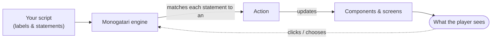

# Welcome

**Monogatari** is a free and open-source visual-novel engine that runs on the web. Your game is a real website, which means it runs almost anywhere — browsers, desktop and mobile — and you can extend it with anything the web can do.

This documentation will take you from an empty folder to a released game.

## Start here

New to Monogatari? Follow these in order:

1. **[Getting Started](getting-started/README.md)** — Install Monogatari and build your first scene.
2. **[Building Blocks](building-blocks/README.md)** — The core concepts: script & labels, characters, variables, actions and components.
3. **[Script Actions](script-actions/README.md)** — The full vocabulary for writing your story: dialog, choices, images, audio and more.
4. **[Components](components/README.md)** — The interface pieces you can restyle and reconfigure.
5. **[Configuration Options](configuration-options/README.md)** — Tune saving, languages, preloading and more.
6. **[Style & Design](style-and-design/README.md)** — Make the game look like yours.
7. **[Releasing Your Game](releasing-your-game/README.md)** — Ship to the web, desktop and mobile.

## How a Monogatari game fits together

You write a **[script](building-blocks/script-and-labels.md)** of statements; the engine matches each statement to an **[action](building-blocks/actions/README.md)**; actions update the **[components](components/README.md)** that make up what the player sees. That loop — read a statement, run an action, update the screen, wait for the player — is the heart of the engine.

## Your game is a website

While this documentation covers many parts of Monogatari, it doesn't cover everything you could do — because your VN is a website now, and the possibilities are endless. Anything you've seen on a website can be done in your game.

So how do you find help for those things? Another benefit of your game being a website: there are lots and lots of tutorials out there. If you want something to happen when a player clicks an image, you can search "JavaScript click image" — there's no need to look for a Monogatari-specific answer. Everything that applies to a website applies to Monogatari too, even step-by-step web-development tutorials.

## Where to ask questions

Of course, you are not alone! If you have a question, a problem, or just want some help, please reach out:

- **[Community Forums](https://community.monogatari.io/)** — a friendly community of people making games just like you.
- **[Discord Server](https://discord.gg/sj4uPrP)** — for something a little more immediate.
- **[Mastodon](https://mastodon.social/@HyuchiaDiego)** or email (on my [website](https://hyuchia.com/)) — for other kinds of questions.
- **[GitHub](https://github.com/Monogatari/Monogatari)** — to report bugs or request features.

You can also check the **[F.A.Q.](f.a.q..md)** to see if your question has already been answered.

## Sponsor the project

If you like Monogatari and would like to support it, becoming a sponsor is the best way to do it. There are many [ways to donate or sponsor the project](https://monogatari.io/#sponsor) — sponsors can also get benefits depending on their tier, like hosting for their games.
