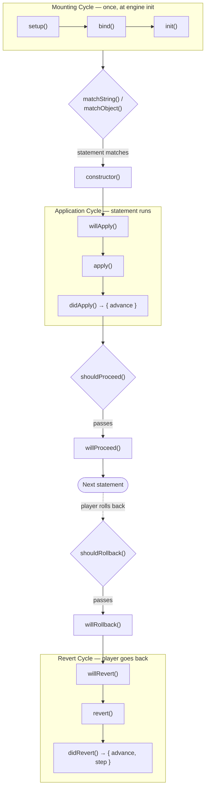

# Life Cycle

An action describes the functionality for a Monogatari statement. When Monogatari reads a part of the script (a statement), it will look for an action that matches the statement and run it.

The life cycle of an action is divided in three parts: **Mounting**, **Application**, and **Reverting**.

## Mounting Cycle

The mounting cycle runs once when the engine initializes. It has 3 steps:

### 1. Setup

Here the action sets up everything it needs for working. This includes:
- Registering state variables
- Registering history objects
- Adding HTML content to the document

```javascript
static async setup(selector) {
    // Register a history for tracking applied actions
    this.engine.history('myaction');
    
    // Register state variables
    this.engine.state({
        myActionActive: false
    });
}
```

### 2. Bind

Once setup is complete, bind event listeners or perform DOM operations:

```javascript
static async bind(selector) {
    // Bind event listeners
    document.addEventListener('click', this.handleClick);
}
```

### 3. Init

Final initialization after setup and binding are complete:

```javascript
static async init(selector) {
    // Perform final operations
    // All HTML elements are now available
}
```

## Statement Matching

Before executing an action, Monogatari checks if the current statement matches. Actions must implement matching functions:

### matchString

For string statements (most common). Receives the statement split into an array by spaces:

```javascript
static matchString([keyword, type, ...rest]) {
    return keyword === 'play' && type === 'music';
}
```

### matchObject

For object/JSON statements:

```javascript
static matchObject(statement) {
    return typeof statement.CustomAction !== 'undefined';
}
```

## Application Cycle

The Application cycle runs when an action is executed from the script.

### 1. Will Apply

Called before the action is applied. Use for pre-application checks or setup:

```javascript
async willApply() {
    // Check preconditions
    if (!this.isValid()) {
        throw new Error('Invalid action');
    }
}
```

If this method throws or returns a rejected promise, the action will not be applied.

### 2. Apply

The core logic of the action. This is where the actual work happens:

```javascript
async apply() {
    // Perform the action
    const element = document.createElement('div');
    element.textContent = this.content;
    document.body.appendChild(element);
}
```

### 3. Did Apply

Called after the action is applied. Use for cleanup, history updates, and determining if the game should advance:

```javascript
async didApply(options = {}) {
    const { updateHistory = true, updateState = true } = options;
    
    if (updateHistory) {
        this.engine.history('myaction').push(this._statement);
    }
    
    if (updateState) {
        this.engine.state({ myActionActive: true });
    }
    
    // Return whether to advance automatically
    return {
        advance: true  // true = advance to next statement
                       // false = wait for user interaction
    };
}
```

## Revert Cycle

The Revert cycle runs when the player goes back in the game.

### 1. Will Revert

Called before reverting. Check if reversion is possible:

```javascript
async willRevert() {
    if (this.engine.history('myaction').length === 0) {
        return Promise.reject('No history to revert');
    }
}
```

If this method throws or returns a rejected promise, the action will not be reverted.

### 2. Revert

Undo the action's effects:

```javascript
async revert() {
    // Remove the element we added
    const element = document.querySelector('.my-element');
    if (element) {
        element.remove();
    }
    
    // Restore previous state from history
    this.engine.history('myaction').pop();
}
```

### 3. Did Revert

Called after reverting. Cleanup and determine navigation behavior:

```javascript
async didRevert() {
    return {
        advance: true,  // true = continue reverting
                        // false = stop here
        step: true      // true = move to previous step
                        // false = stay on current step
    };
}
```

## Flow Control Methods

These static methods are called by the engine to check if the game can proceed or rollback:

### shouldProceed

Called when the user clicks to advance or auto-play triggers:

```javascript
static async shouldProceed(options) {
    const { userInitiated, skip, autoPlay } = options;
    
    // Return resolved promise to allow proceeding
    // Throw or reject to prevent proceeding
    if (this.isBlocking) {
        throw new Error('Action is blocking');
    }
}
```

### willProceed

Called after `shouldProceed` passes, before advancing:

```javascript
static async willProceed() {
    // Perform any cleanup before advancing
}
```

### shouldRollback

Called when the user tries to go back:

```javascript
static async shouldRollback() {
    // Return resolved promise to allow rollback
    // Throw or reject to prevent rollback
}
```

### willRollback

Called after `shouldRollback` passes, before reverting:

```javascript
static async willRollback() {
    // Prepare for rollback
}
```

## Event Methods

These static methods respond to game events:

### onStart

Called when the player starts a new game:

```javascript
static async onStart() {
    // Initialize for new game
    this.engine.state({ myActionActive: false });
}
```

### onLoad

Called when a saved game is loaded. Restore visual/audio state:

```javascript
static async onLoad() {
    // Restore state from saved game
    const state = this.engine.state('myActionActive');
    if (state) {
        // Re-apply visual elements
    }
}
```

### onSave

Called when the game is saved:

```javascript
static async onSave(slot) {
    // slot.key - The storage key
    // slot.value - The saved data
    
    // Perform any save-related operations
}
```

### reset

Called when a game ends or before loading a new game:

```javascript
static async reset() {
    // Clean up all action-related elements
    document.querySelectorAll('.my-elements').forEach(el => el.remove());
    
    // Reset state
    this.engine.state({ myActionActive: false });
}
```

## Hook Methods

These static methods allow intercepting action execution:

### beforeRun / afterRun

Called before/after an action's application cycle:

```javascript
static async beforeRun(context) {
    // Called before willApply/apply/didApply
}

static async afterRun(context) {
    // Called after the application cycle completes
}
```

### beforeRevert / afterRevert

Called before/after an action's revert cycle:

```javascript
static async beforeRevert(context) {
    // Called before willRevert/revert/didRevert
}

static async afterRevert(context) {
    // Called after the revert cycle completes
}
```

## Instance Methods

### interrupt

Called to interrupt an ongoing action (e.g., skipping typewriter animation):

```javascript
async interrupt() {
    // Stop ongoing animation or process
    this.stopAnimation();
}
```

### Helper Methods

```javascript
// Get the original statement
const statement = this._statement;

// Get current cycle ('Application' or 'Revert')
const cycle = this._cycle;

// Access extra context
const extras = this._extras;

// Access the engine
const engine = this.engine;
```

## Complete Life Cycle Diagram



Independently of this flow, the engine calls the **event methods** at specific moments: `onStart()` when a new game begins, `onLoad()` when a save is loaded, `onSave()` when the game is saved, and `reset()` when a game ends or before a new game loads.

## Related

- [Actions Overview](README.md) - Creating and registering actions
- [Components](../components/) - Creating custom UI components
