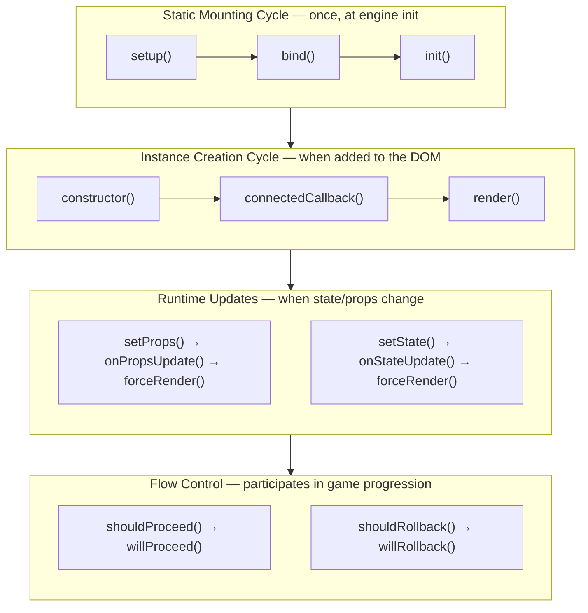

# Life Cycle

A component represents an object or content in the game such as screens, menus, and all other visual or structural elements. Components are custom HTML elements that encapsulate their own HTML, CSS, and JavaScript logic.

## Mounting Cycle

The life cycle of a component follows the same mounting cycle as actions. This cycle runs once when the engine initializes.

### 1. Setup

Set up everything the component needs for working:

```javascript
static async setup() {
    // Add HTML content to the document
    this.engine.element().find('game-screen').append('<my-component></my-component>');
    
    // Initialize configuration
    this.configuration({
        defaultValue: 'something'
    });
}
```

### 2. Bind

Bind event listeners and perform DOM operations:

```javascript
static async bind() {
    // Bind global event listeners
    document.addEventListener('keydown', (e) => {
        if (e.key === 'Escape') {
            this.instances((instance) => instance.hide());
        }
    });
}
```

### 3. Init

Final initialization after setup and binding:

```javascript
static async init() {
    // Perform final operations
    // All components are now available
}
```

## Instance Lifecycle

Individual component instances also have their own lifecycle methods.

### connectedCallback

Called when the component is added to the DOM:

```javascript
async connectedCallback() {
    // Always call super to ensure proper initialization
    await super.connectedCallback();
    
    // Component is now in the DOM
    this.classList.add('ready');
}
```

### render

Returns the HTML content for the component:

```javascript
render() {
    return `
        <div class="container">
            <h1>${this.props.title}</h1>
            <slot></slot>
        </div>
    `;
}
```

### onStateUpdate

Called when component state changes:

```javascript
async onStateUpdate(property, oldValue, newValue) {
    if (property === 'visible') {
        this.classList.toggle('hidden', !newValue);
    }
}
```

### onPropsUpdate

Called when component props change:

```javascript
async onPropsUpdate(property, oldValue, newValue) {
    if (property === 'title') {
        this.querySelector('h1').textContent = newValue;
    }
}
```

## Flow Control Methods

Components can participate in game flow control, both at the static level (all instances) and instance level.

### Static Flow Control

These methods iterate over all instances of the component:

```javascript
// Called when user tries to advance
static async shouldProceed(options) {
    const promises = [];
    this.instances((instance) => {
        promises.push(instance.shouldProceed());
    });
    return Promise.all(promises);
}

// Called after shouldProceed passes
static async willProceed() {
    const promises = [];
    this.instances((instance) => {
        promises.push(instance.willProceed());
    });
    return Promise.all(promises);
}

// Called when user tries to go back
static async shouldRollback() {
    const promises = [];
    this.instances((instance) => {
        promises.push(instance.shouldRollback());
    });
    return Promise.all(promises);
}

// Called after shouldRollback passes
static async willRollback() {
    const promises = [];
    this.instances((instance) => {
        promises.push(instance.willRollback());
    });
    return Promise.all(promises);
}
```

### Instance Flow Control

Each component instance can implement these methods:

```javascript
// Check if this instance allows proceeding
async shouldProceed() {
    if (this.isAnimating) {
        throw new Error('Animation in progress');
    }
}

// Respond to game proceeding
async willProceed() {
    this.classList.remove('active');
}

// Check if this instance allows rollback
async shouldRollback() {
    // Allow by default
}

// Respond to game reverting
async willRollback() {
    this.resetState();
}
```

## Event Methods

### onStart

Called when a new game starts:

```javascript
static async onStart() {
    // Reset all instances for new game
    this.instances((instance) => {
        instance.reset();
    });
}
```

### onLoad

Called when a saved game is loaded:

```javascript
static async onLoad() {
    // Restore component state
    this.instances((instance) => {
        instance.restoreFromSave();
    });
}
```

### onSave

Called when the game is saved:

```javascript
static async onSave() {
    // Perform any save-related operations
}
```

### onReset

Called when the game ends or before loading a new game:

```javascript
// Static version - iterates all instances
static async onReset() {
    const promises = [];
    this.instances((instance) => {
        promises.push(instance.onReset());
    });
    await Promise.all(promises);
}

// Instance version
async onReset() {
    this.state = {};
    this.classList.remove('active');
}
```

## Complete Life Cycle Diagram



Independently of this flow, the engine calls the **event methods** at specific moments: `onStart()` when a new game begins, `onLoad()` when a save is loaded, `onSave()` when the game is saved, and `onReset()` when a game ends or before a new game loads.

## Related

- [Components Overview](README.md) - Creating and registering components
- [Built-in Properties](built-in-properties.md) - Component properties
- [Built-in Functions](built-in-functions.md) - Component methods
- [Actions](../actions/) - Creating custom script actions
