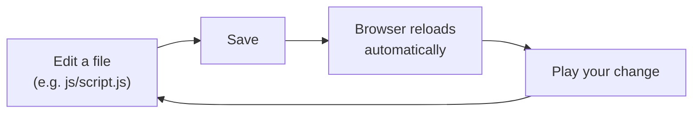

# Step 4: Make Your First Visual Novel

Time to make it yours. Keep the dev server from [Step 2](getting-monogatari.md) running (`bun run serve`) with your game open at [http://localhost:5100](http://localhost:5100) — thanks to live reload, you'll see every change the instant you save.

## 1. Play the sample first

Play through the sample game once. It asks your name, greets you, and offers a Yes/No choice — a tiny tour of dialog, input and branching. Now let's see how it's built and change it.

## 2. Open your story

Open `js/script.js` in your editor. Near the bottom you'll find the `monogatari.script({ … })` block — this is your whole story. Each **label** (like `'Start'`) holds a list of things that happen in order:

```javascript
monogatari.script ({
    // The game starts here.
    'Start': [
        'show scene #f7f6f6 with fadeIn',
        'y Hi! Welcome to Monogatari!',
        'end'
    ]
});
```

Each item is one step. A plain line of text is narration; prefix it with a character's id (here, `y`) and that character says it. `show scene` sets the background — `#f7f6f6` is just a colour, but it can be an image too (you'll add one below).

> [!NOTE]
> The `'Start'` label is where every game begins. You can change the starting label
> with the `Label` setting in [`options.js`](../configuration-options/game-configuration/README.md).

## 3. Change a line — and watch it update

Change the greeting:

```javascript
'y Hi! This is my very own visual novel!',
```

**Save the file.** Your browser reloads on its own — start the game again and your new line is there. That save-and-see loop is how you'll build your whole game.

## 4. Add more dialog

Lines are just a list, so add as many as you like:

```javascript
'Start': [
    'show scene #f7f6f6 with fadeIn',
    'y Hi! This is my very own visual novel!',
    'y Adding dialog is as easy as adding lines to this list.',
    'y Let me introduce a friend…',
    'end'
],
```

## 5. Add a character

Find the `monogatari.characters({ … })` block above the script — the sample defines one character, `y` (Yui). Add your own beside it:

```javascript
monogatari.characters ({
    'y': {
        name: 'Yui',
        color: '#5bcaff'
    },
    'm': {
        name: 'Mio',
        color: '#ff8fab'
    }
});
```

Now `m` can speak. Add a line to your script:

```javascript
'm Nice to meet you!',
```

There's much more you can give a character — sprites, expressions and more — in [Characters](../building-blocks/characters.md).

## 6. Challenge: add a real scene

Backgrounds are images you declare once and then `show`:

1. Drop an image into `assets/scenes/` — say `bedroom.jpg`.
2. Declare it in the `scenes` asset list in `js/script.js`:

   ```javascript
   monogatari.assets ('scenes', {
       'bedroom': 'bedroom.jpg'
   });
   ```

3. Show it in your script:

   ```javascript
   'Start': [
       'show scene bedroom with fadeIn',
       'y Welcome to my room!',
       'end'
   ],
   ```

Save, and there's your scene. More options in [Show Scene](../script-actions/show-scene.md).

## The workflow you just learned



**Edit → Save → it reloads → play → repeat.** That loop is the whole job.

## What's next

You've made your first game! From here:

- **Tell your story:** [Script & Labels](../building-blocks/script-and-labels.md), [Dialogs](../script-actions/dialogs.md), [Choices](../script-actions/choices.md)
- **Bring it to life:** [Characters](../script-actions/characters.md), [Show Scene](../script-actions/show-scene.md), [Play Music](../script-actions/play-music.md)
- **Make it yours:** [Player Preferences](../configuration-options/player-preferences.md), [Style & Design](../style-and-design/README.md)
- **Ship it:** [Releasing Your Game](../releasing-your-game/README.md)

> [!TIP]
> Something not working? Open your browser's developer console (`F12`) — Monogatari
> prints helpful messages there when a line in your script isn't quite right.
